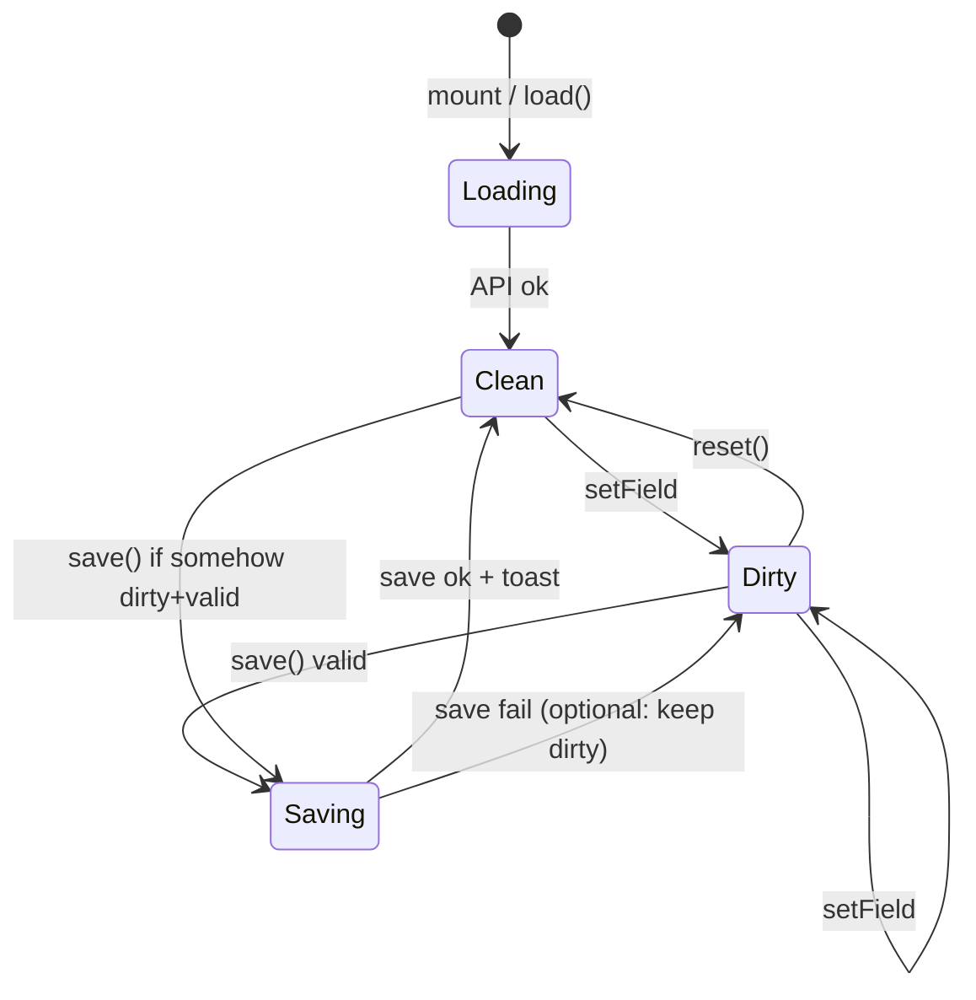

# Checkout Customisation — Implementation Plan

Glomo merchants customise their checkout on a single screen: **form (left)** + **live preview (right)**. Configurable fields: **button text**, **background colour**, **logo URL**. Data is loaded from and persisted to a **mock async API**. Global state uses **Zustand**; pure logic lives in **utils** files.

---

## 1. Goals & non-goals

| In scope | Out of scope (for now) |
|----------|-------------------------|
| Load / save / reset customisations | Real backend, auth, multi-tenant |
| Real-time preview from draft form values | Image upload / CDN proxy |
| Field validation + inline errors | Additional customisation fields |
| Four UX states (default, validation, saving, success) | Routing / multiple pages |

---

## 2. UX summary

### Layout

```
┌─────────────────────────────────────────────────────────────┐
│  [Reset]  [Save / Saving...]                    (toolbar)   │
├──────────────────────────┬──────────────────────────────────┤
│  Customisation form      │  Checkout preview (live)         │
│  • Button text           │  • Logo (from logoUrl)           │
│  • Background colour     │  • Background colour             │
│  • Logo URL              │  • Pay button (buttonText)       │
└──────────────────────────┴──────────────────────────────────┘
                              Toast: "Saved" (brief, on success)
```

### Behaviour matrix

| Event | Form | Preview | Reset | Save |
|-------|------|---------|-------|------|
| **Load** | Populated from API | Renders saved values | Disabled | Disabled |
| **Edit (dirty)** | User changes | Updates immediately from **draft** | Enabled if dirty | Enabled only if dirty **and** valid |
| **Edit (invalid)** | Inline errors | Still shows draft (optional: keep showing last valid preview — **use draft** for simplicity) | Enabled | Disabled |
| **Save click** | Editable | Draft values | Disabled | Spinner + "Saving...", disabled |
| **Save success** | Matches saved | Saved values | Disabled | Disabled + toast |
| **Reset click** | Reverts to last saved | Saved values | Disabled | Disabled |

### Validation rules

| Field | Rule | Error copy (example) |
|-------|------|----------------------|
| `buttonText` | Required, min 3 chars | "Button text is required" / "At least 3 characters" |
| `backgroundColor` | Valid hex (`#RGB` or `#RRGGBB`, case-insensitive) | "Enter a valid hex colour (e.g. #ffffff)" |
| `logoUrl` | Valid URL (`URL` constructor or equivalent) | "Enter a valid URL" |

Show inline errors **under each invalid field** when the field is dirty or after first submit attempt — **recommend: show when dirty** so State 2 matches spec without extra “touched” machinery.

### Four UI states (acceptance)

1. **Default (loaded, clean)** — Both buttons disabled; form = API data; preview = saved values.
2. **Validation error** — Dirty; Reset enabled; Save disabled; invalid fields show inline errors (e.g. bad hex + bad URL).
3. **Save in flight** — Save shows spinner + "Saving..."; both buttons disabled; inputs remain editable; no Reset (avoid race).
4. **Save success** — Buttons disabled; brief "Saved" toast; preview = saved values.

---

## 3. Architecture (modular, minimal)

Feature-first folder under `src/customisation/`. One Zustand store, thin components, fat-free utils.

```
src/
├── App.tsx                          # Renders <CustomisationPage />
├── lib/utils.ts                     # cn() — existing shadcn helper
└── customisation/
    ├── types.ts                     # Customisations, API shapes
    ├── api/
    │   └── customisationApi.ts      # getCustomisations, saveCustomisations (mock)
    ├── store/
    │   └── useCustomisationStore.ts # Zustand: draft, saved, status, actions
    ├── utils/
    │   ├── validation.ts            # validateField, validateForm → errors map
    │   └── formState.ts             # isDirty, canSave, canReset (pure helpers)
    ├── hooks/
    │   └── useCustomisation.ts      # Optional: load on mount, bind actions
    └── components/
        ├── CustomisationPage.tsx    # Page shell + load effect
        ├── Toolbar.tsx              # Reset + Save
        ├── CustomisationForm.tsx    # Left column
        ├── FormField.tsx            # Label + input + error line
        ├── CheckoutPreview.tsx      # Right column — reads draft from store
        └── SavedToast.tsx           # Ephemeral "Saved" message
```

**Extension points (without over-engineering):**

- New field → add to `Customisations` type, `validation.ts`, form row, preview prop.
- Real API → swap `customisationApi.ts` implementation; store actions unchanged.
- Server-side validation errors → extend store with `saveError` and map to fields later.

**Dependencies (already in repo):** React 19, Tailwind, shadcn `Button`, Zustand, `cn` from `@/lib/utils`.

---

## 4. Data model

```ts
// types.ts
export type Customisations = {
  buttonText: string;
  backgroundColor: string;
  logoUrl: string;
};

export type CustomisationResponse = {
  customisations: Customisations;
};

export type FieldErrors = Partial<Record<keyof Customisations, string>>;

export type SaveStatus = "idle" | "loading" | "saving";
```

**Store slices (single Zustand store):**

| State | Purpose |
|-------|---------|
| `saved` | Last successfully persisted values (from API or after save) |
| `draft` | Current form values (preview + inputs read this) |
| `status` | `"loading"` \| `"idle"` \| `"saving"` |
| `toastVisible` | Brief flag after successful save (auto-clear ~2s) |

**Actions:**

- `load()` — fetch API → set `saved` + `draft`, `status → idle`
- `setField(key, value)` — update `draft` only (no API)
- `reset()` — `draft ← saved`, clear transient UI
- `save()` — if valid + dirty, `status → saving`, API, on success `saved ← draft`, `status → idle`, show toast

---

## 5. Zustand store design

```ts
// useCustomisationStore.ts (sketch)
interface CustomisationState {
  saved: Customisations | null;
  draft: Customisations;
  status: SaveStatus;
  toastVisible: boolean;

  load: () => Promise<void>;
  setField: <K extends keyof Customisations>(key: K, value: Customisations[K]) => void;
  reset: () => void;
  save: () => Promise<void>;
  dismissToast: () => void;
}
```

**Selectors (exported pure functions in `utils/formState.ts`, used in components):**

```ts
isDirty(saved, draft)           // shallow compare three keys
validateForm(draft)             // → FieldErrors
isValid(errors)                 // Object.keys(errors).length === 0
canReset({ isDirty, status })   // isDirty && status !== 'saving'
canSave({ isDirty, isValid, status })  // isDirty && isValid && status !== 'saving'
```

Components subscribe with fine-grained selectors where helpful, e.g. `useCustomisationStore(s => s.draft)` to limit re-renders.

**Concurrency:** While `status === 'saving'`, ignore duplicate `save()` calls; `reset()` is disabled in UI and should no-op in the action if called anyway.

---

## 6. Mock API

`src/customisation/api/customisationApi.ts`

- In-memory module-level variable holds current customisations (seed matches spec default).
- `getCustomisations(): Promise<CustomisationResponse>` — `delay(300–500ms)`.
- `saveCustomisations(payload: Customisations): Promise<CustomisationResponse>` — `delay(400–600ms)`, assign memory, return shape:

```json
{
  "customisations": {
    "buttonText": "Pay now",
    "backgroundColor": "#0F172A",
    "logoUrl": "https://example.com/logo.png"
  }
}
```

Use `setTimeout` + `Promise` only; no network. Keeps swap to `fetch` trivial later.

---

## 7. Utils (separate files)

### `utils/validation.ts`

Pure functions, no React/Zustand:

- `validateButtonText(value: string): string | undefined`
- `validateBackgroundColor(value: string): string | undefined`
- `validateLogoUrl(value: string): string | undefined`
- `validateForm(draft: Customisations): FieldErrors`

Hex check: `/^#([0-9A-Fa-f]{3}|[0-9A-Fa-f]{6})$/`  
URL check: `try { new URL(value); return ok } catch { invalid }` — require `http:` or `https:` if product needs it.

### `utils/formState.ts`

- `isDirty(a, b)` — compare normalised strings (trim optional for text only if desired; **default: strict equality**).
- `canReset`, `canSave` — as above.

Unit-test these files with Vitest (`npm run test:unit`).

---

## 8. Components (responsibilities)

| Component | Responsibility |
|-----------|----------------|
| `CustomisationPage` | Two-column layout; `useEffect` → `load()` on mount; loading skeleton/spinner optional |
| `Toolbar` | Reset + Save; derives disabled from `formState` + `status`; Save shows loader + "Saving..." |
| `CustomisationForm` | Controlled inputs bound to `draft` + `setField`; maps `FieldErrors` to `FormField` |
| `FormField` | Accessible label, input, `aria-invalid`, error text |
| `CheckoutPreview` | Card mimicking checkout: `` with `onError` fallback, `style={{ backgroundColor }}`, button label = `draft.buttonText` |
| `SavedToast` | Fixed/portal toast when `toastVisible`; auto-dismiss via `setTimeout` in store or small hook |

**Preview image errors:** On `img` `onError`, show placeholder block (no broken icon spam); do not block save if URL is syntactically valid.

**App entry:** Replace default CRA content in `App.tsx` with `<CustomisationPage />` and Tailwind layout classes.

---

## 9. State flow (diagram)



---

## 10. Implementation phases

### Phase 1 — Foundation
- [ ] Add `types.ts`, mock API, validation + formState utils
- [ ] Implement Zustand store with `load`, `setField`, `reset`, `save`
- [ ] Vitest: validation edge cases (hex, URL, button length)

### Phase 2 — UI
- [ ] `CustomisationPage` layout + `Toolbar` + `FormField` + form inputs
- [ ] `CheckoutPreview` wired to `draft`
- [ ] Wire `App.tsx`, Tailwind page styles

### Phase 3 — UX polish
- [ ] Button disabled rules (States 1–4)
- [ ] Save spinner + "Saving..."
- [ ] `SavedToast` with auto-hide
- [ ] Loading state on initial fetch

### Phase 4 — Tests
- [ ] Store tests: dirty/save/reset/saving guard
- [ ] RTL: happy path load → edit → save; validation disables save
- [ ] Optional Playwright: two-column smoke + save flow

---

## 11. Testing checklist

| Area | Cases |
|------|--------|
| `validation.ts` | Empty text; 2 chars; valid hex 3/6 digit; invalid hex; valid/invalid URL |
| `formState.ts` | Dirty detection; canSave false when invalid or clean |
| Store | load populates; save updates `saved`; reset restores; no double-save |
| UI | State 2: invalid fields show errors, Save disabled; State 3: buttons disabled during save |

---

## 12. Accessibility & security notes

- Associate labels with inputs; expose errors via `aria-describedby`.
- Logo URL is user-supplied: render in `` only (no `dangerouslySetInnerHTML`).
- Prefer `rel="noopener noreferrer"` if preview ever links out.
- Client messages stay generic on API failure ("Could not save. Try again.").

---

## 13. File checklist (create order)

1. `customisation/types.ts`
2. `customisation/utils/validation.ts` + `formState.ts`
3. `customisation/api/customisationApi.ts`
4. `customisation/store/useCustomisationStore.ts`
5. `customisation/components/*`
6. `customisation/hooks/useCustomisation.ts` (only if mount logic clutters page)
7. Update `App.tsx`
8. Tests alongside utils and store

---

## 14. Default seed data (mock API)

Align initial in-memory and test fixtures with:

```ts
const DEFAULT: Customisations = {
  buttonText: "Pay now",
  backgroundColor: "#0F172A",
  logoUrl: "https://example.com/logo.png",
};
```

This matches the required API response shape and State 1 screenshots.
